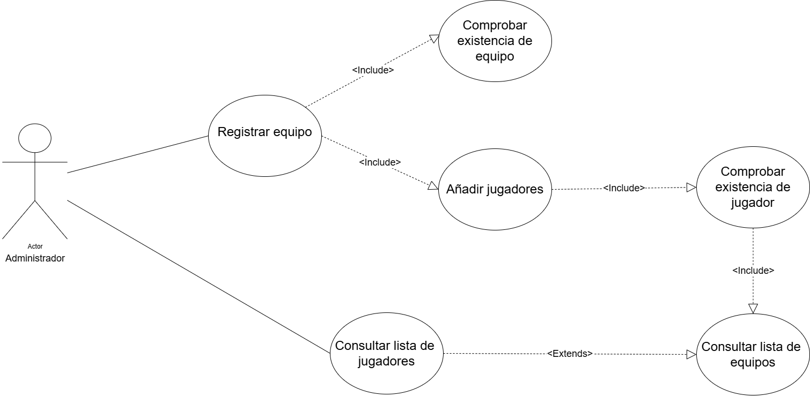
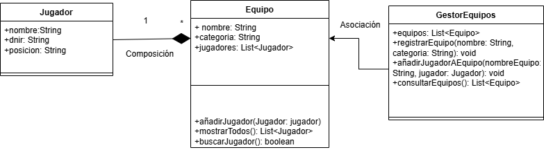

# Sistema de Gestión de Torneos de eSports

## Autor
- Marta Mercado Aguilar
- Github: martam-art

## Descripción del Proyecto

https://github.com/martam-art/AD3_Torneo_ESports_Uml

Este proyecto implementa un sistema de gestión de torneos de eSports utilizando UML para el modelado y Java para la implementación.
Se ha realizado un modelado de funcionalidad con diagramas de casos de uso y un modelado estructural con diagramas de clases de la gestión de equipos y jugadores. 
También se ha creado la estructura base del proyecto con clases de entidad, control e interfaz, además del punto de entrada del programa, en sus paquetes correspondientes para el desarrollo futuro de la implementación del sistema en Java, tras la fase de diseño. 

## Diagramas UML

Como una parte de este sistema es gestionar equipos y jugadores del torneo, las funcionalidades se centran en registrar equipos, añadir jugadores a equipos como parte del proceso de registro y consultar listas de equipos y jugadores.

### Diagrama de Casos de Uso


Como actor principal se ha elegido al administrador, que es el que se va a encargar de las funcionalidades principales: 

- Registrar equipo: permite al administrador registrar un nuevo equipo. Incluye verificar que el equipo no exista previamente y añadir los jugadores, esto hace que ningún equipo esté vacío.
- Añadir jugadores: incluido dentro de registrar equipo e incluye comprobar existencia de jugador para evitar agregar jugadores repetidos. 
- Consultar lista de equipos: incluido por el caso anterior, muestra todos los equipos registrados para buscar jugadores en ellos.
- Consultar lista de jugadores: permite ver los jugadores asociados a los equipos y desde este se extiende la funcionalidad anterior.

### Diagrama de Clases


### Entidades 

#### **Jugador**
- **Atributos:**
  - `nombre: String`
  - `dni: String`
  - `posicion: String`

#### **Equipo**
- **Atributos:**
  - `nombre: String`
  - `categoria: String`
  - `jugadores: List<Jugador>`
- **Métodos:**
  - `añadirJugador(Jugador jugador)`
  - `mostrarTodos(): List<Jugador>`
  - `buscarJugador(): boolean`
  
### Lógica de Control

#### **GestorEquipos**
- **Contiene:**`
  - `equipos: List<Equipo>`
- **Métodos:**
  - `añadirJugadorAEquipo(nombreEquipo: String, jugador: Jugador): void`
  - `registrarEquipo(nombre: String, categoria: String): void`
  - `consultarEquipo(): List<Equipo>`

### Relaciones y Cardinalidad

- Relación de composición entre Equipo y Jugador: un equipo contiene a muchos jugadores y estos se eliminan, el equipo también.
- Relación de Asociación entre GestorEquipos y Equipo: el gestor administra una lista de equipos y realiza operaciones con ellos. 


## Estructura del Proyecto

```
torneo-esports-uml/
├── src/
│   └── es/empresa/torneo/
│       ├── modelo/
│       ├── control/
│       ├── vista/
│       └── Main.java
├── diagrams/
│   ├── CasosDeUso.drawio.png
│   └── DiagramaDeClases.png
├── README.md
└── .gitignore
```
## Instalación y Ejecución 
1. Clonar el repositorio:
`git clone https://github.com/martam-art/AD3_Torneo_ESports_Uml.git`

## Conclusiones Sobre el aprendizaje obtenido.
Este proyecto me ha enseñado la importancia del análisis previo y de entender profundamente lo que se quiere construir antes de empezar a escribir código. Los diagramas han sido un gran descubrimiento para mi porque permiten visualizar de manera sencilla y clara qué se espera del sistema y aprender a utilizar las relaciones ayuda a simplificar ideas más complejas. Por último, comprender las clases de entidad, control e interfaz me ha permitido ver bien cómo se organiza un sistema y la importancia que esto tiene de cara al desarrollo posterior del código.
